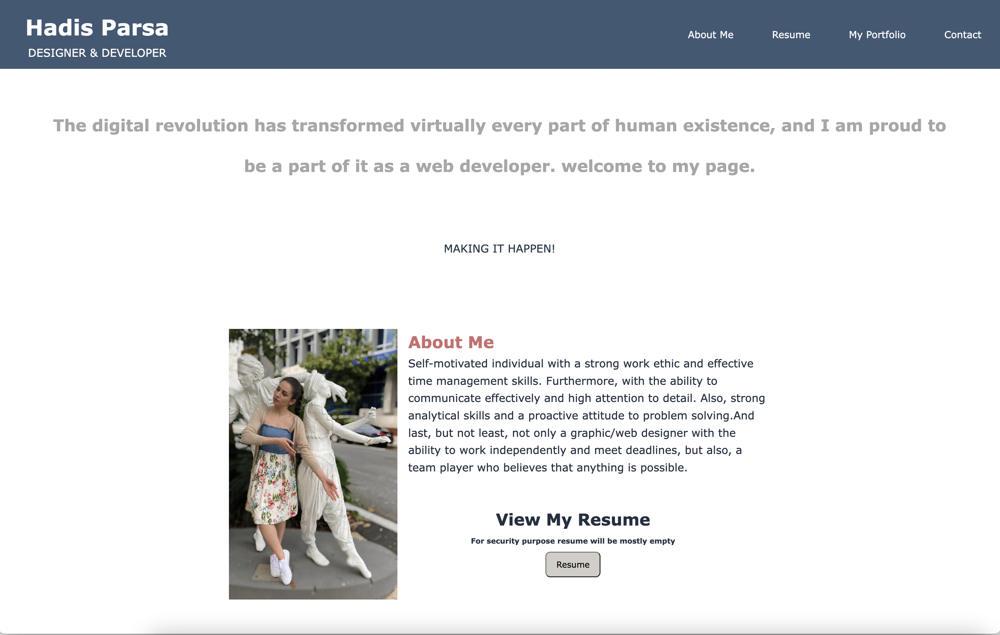

# <My-REACT-Portfolio>

##  My REACT Portfolio

 Being a web developer means being part of a community. I need a place not only to share my projects while I'm applying for jobs or working as a freelancer but also to share my work with other developers and collaborate on projects.

So i create a portfolio using my new React skills, which will help set me apart from other developers whose portfolios don’t use the latest technologies. 

## User Story

```md
AS AN employer looking for candidates with experience building single-page applications
I WANT to view a potential employee's deployed React portfolio of work samples
SO THAT I can assess whether they're a good candidate for an open position
```
## Summery 

```md
GIVEN a single-page application portfolio for a web developer
WHEN I load the portfolio
THEN I am presented with a page containing a header, a section for content, and a footer
WHEN I view the header
THEN I am presented with the developer's name and navigation with titles corresponding to different sections of the portfolio
WHEN I view the navigation titles
THEN I am presented with the titles About Me, Portfolio, Contact, and Resume, and the title corresponding to the current section is highlighted
WHEN I click on a navigation title
THEN I am presented with the corresponding section below the navigation without the page reloading and that title is highlighted
WHEN I load the portfolio the first time
THEN the About Me title and section are selected by default
WHEN I am presented with the About Me section
THEN I see a recent photo or avatar of the developer and a short bio about them
WHEN I am presented with the Portfolio section
THEN I see titled images of six of the developer’s applications with links to both the deployed applications and the corresponding GitHub repositories
WHEN I am presented with the Contact section
THEN I see a contact form with fields for a name, an email address, and a message
WHEN I move my cursor out of one of the form fields without entering text
THEN I receive a notification that this field is required
WHEN I enter text into the email address field
THEN I receive a notification if I have entered an invalid email address
WHEN I am presented with the Resume section
THEN I see a link to a downloadable resume and a list of the developer’s proficiencies
WHEN I view the footer
THEN I am presented with text or icon links to the developer’s GitHub and LinkedIn profiles, and their profile on a third platform (Stack Overflow, Twitter)
```

## Mock-Up

The web application's appearance:

[Application deployed at live URL in heroku.](https://hp-my-react-portfolio.herokuapp.com/)


The following screen shots shows the web application's appearance and functionality:




## Installation

Please clone the github repository and then run: `npm i` to install the dependencies and packages.
Once you have install the packages, run `npm start` to open the application in a local environment. It will be on localhost:3000

### Technical

I deploied this application to my GitHub Page. 
Follow the instructions in the Git Guide or consult the [Create React App Docs on GitHub Pages](https://create-react-app.dev/docs/deployment/#github-pages) to create a build that you can deploy.

* Choose a color palette that distinguishes my site from the default Bootstrap theme and unstyled HTML sites. Refer to resources like [Coolors](https://coolors.co/).


